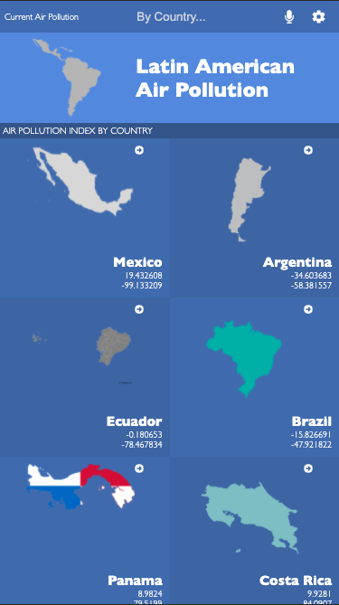
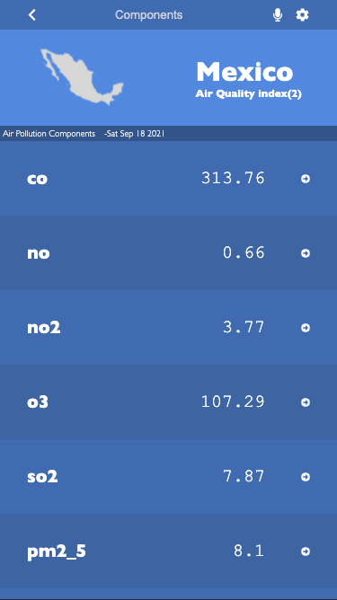

# Air Pollution

> Build air pollution mobile app with React and Redux.

<div align="center">


</div>

Mobile ScreenShots

## Built With

- React & JavaScript

## Live Demo

[Live Demo Link](https://er-contreras.github.io/air-pollution/#/)

## Getting Started

### Prerequisites
  - Read about [React](https://reactjs.org/docs/getting-started.html) before start.
  - Just follow the steps for Getting started, Asset Managment(optional), Output Management and Development (Install the webpack-dev-server)

### Setup
  - Better have [VS Code](https://code.visualstudio.com/) installed or install the source-code editor of your preference. 

### Install
  - In the terminal go to the folder you going to work and write the next. 
  ```
  git clone https://github.com/eri8-9/air-pollution.git
  ```
  - Next go to VS Code editor and open the folder where you installed the repository.
### Usage
  - Don't forget to create a branch to star working on the project.
  - Now that you have everything set up you are ready to work.

## Authors

👤 **Christian Erick Contreras**

- GitHub: [@eri8-9](https://github.com/er-contreras)
- Linkedin: [LinkedIn](https:linkedin.com/in/er-contreras)
- Twitter: [@ChristianErick_](https://twitter.com/er_contreras_)

## Show your support

Give a ⭐️ if you like this project!

## Acknowledgments

- Microverse
- We use the design from [Nelson Sakwa](https://www.behance.net/gallery/31579789/Ballhead-App-%28Free-PSDs%29) example to built this page.

## 📝 License

- <a rel="license" href="http://creativecommons.org/licenses/by-nc/4.0/"></a><br />This work is licensed under a <a rel="license" href="http://creativecommons.org/licenses/by-nc/4.0/">Creative Commons Attribution-NonCommercial 4.0 International License</a>.
